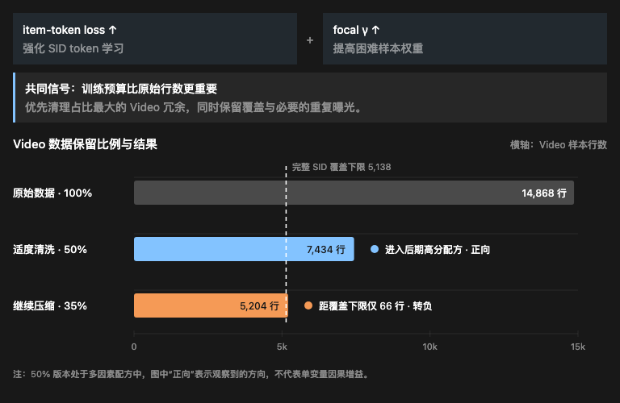

# OneReason / LLM-Rec SFT 复盘

## 已验证的提分路径

`懂用户` 为两个用户任务之和，`懂推荐` 为视频、电商、广告、直播四项之和。

> 表中分数均来自已经完成的线上评测。“已验证”表示整套配方曾达到该分数，不代表多因素阶段的每个改动都获得了单变量因果验证。

| 阶段 | 总分 | 懂物料 | 懂用户 | 懂推荐 | 懂世界 | 改动 / 备注 |
| --- | ---: | ---: | ---: | ---: | ---: | --- |
| 预训练直评 | 0.6704 | 0.1533 | 0.0091 | 0.3667 | 0.1413 | 起点；未做 SFT。 |
| LoRA Seed SFT | 0.8635 | 0.1840 | **0.1264** | 0.4174 | 0.1357 | 官方 seed dataset；LoRA 峰值学习率 `2e-4`。 |
| CEval-Letter | 0.9186 | 0.2146 | 0.1031 | 0.4648 | 0.1361 | 加入空 `<think>` + 单字母答案的 CEval 数据。 |
| CEval-Letter + C2T | 0.9263 | 0.2146 | 0.1078 | 0.4618 | 0.1420 | 加入 4,742 条 Caption2Token。 |
| + Math | 0.9573 | **0.2453** | 0.1105 | 0.4529 | 0.1487 | 第一次加入 Math 数据。 |
| + 多因素 | 0.9768 | 0.2146 | 0.1063 | **0.4949** | 0.1610 | LogicChain→Action + Math Plus + Item2 + 视频减半；非单变量对照。 |
| Action100（首次评测） | 0.9881 | **0.2453** | 0.1157 | 0.4650 | **0.1621** | 在 `0.9768` 直接父模型上追加 Action100。 |
| Action100（重测） | **1.0014** | **0.2453** | 0.1162 | 0.4778 | **0.1621** | 同一模型的最新重测结果。 |

Action100 重测子项：懂用户为 `0.0806、0.0356`；懂推荐为 `0.0768、0.1360、0.1498、0.1152`。

## 六类数据资产

每个目录均包含数据卡、manifest 和合成样例；LogicChain → ActionSelect 额外提供构建代码，ActionSelect 额外提供完整的 104 条 JSONL。

| 主线 | 规模 | 样例 | 证据边界 |
| --- | ---: | --- | --- |
| [CEval-Letter](data/ceval-letter/README.md) | 13,948 | [查看样例](data/ceval-letter/README.md#合成样例) | 早期整体表现有明确的正向变化，但并非“懂世界”单项提升。 |
| [懂世界 Math](data/math/README.md) | 21,799 + 21,799 | [查看样例](data/math/README.md#合成样例) | Math23K 与 Math Plus 两层数据均经过验证，有利于提升“懂世界”。 |
| [Half Video](data/half-video/README.md) | 19,204 → 11,770 | [查看样例](data/half-video/README.md#合成样例) | 只减半视频行；缺少隔离因果对照。 |
| [LogicChain → ActionSelect](data/logicchain-to-actionselect/README.md) | 1,298 | [查看样例](data/logicchain-to-actionselect/README.md#合成样例) | 增加 ActionSelect 样本有利于缓解复读问题。 |
| [ActionSelect](data/actionselect/README.md) | 104 | [查看样例](data/actionselect/README.md#合成样例) | 104 条精心构建的 ActionSelect 数据带来小幅提升。 |
| [Caption2Token](data/c2t-sa/README.md) | 4,742 | [查看样例](data/c2t-sa/README.md#合成样例) | seed-unseen `prefix_s_a` + OneReason 域比例重平衡。 |

## 提分过程中的观察与判断

### 难样本预算

调整 item-token loss 权重和 focal `γ` 后，线上分数出现了超出预期、但尚不稳定的正向变化。两者的优化重点不同：item-token loss 强化 SID token 的学习，focal loss 则提高困难样本在训练中的权重。两种调整均产生正向信号，由此推测 seed dataset 中存在大量简单且重复的文本样本：它们占用了训练预算，却没有提供足够的新信息。基于这一判断，我清洗了“懂推荐”中占比最大的 Video domain，将视频样本减少约 50%，其他推荐域保持不变。线上结果进一步验证了这一方向，Video 子项提升至 `0.0960`；但继续将保留比例降低到 35% 后，收益转为负向。这说明真正有效的是适度去除冗余，而不是一味减少数据。



### 面向评测分布补数据

这是一种并不优雅、却在竞赛中确实有效的提分策略：根据评测题型补充同构训练数据，提高训练分布与评测分布的匹配度。我判断“懂世界”中包含较多数学单选题，因此先后加入 Math23K 和 Math Plus。“懂世界”从 LoRA Seed SFT 阶段的 `0.1357`，提升至 Math23K 阶段的 `0.1487`，并在加入 Math Plus 后达到 `0.1610`。两层数学数据均有效提高了模型对“懂世界”评测题型的覆盖。

### 懂用户的 Prompt 扰动

评测日志中的角色、规则、schema、示例和版式均比 seed 更丰富。基于这一观察，我对 seed prompt 做了相应增强，但没有观察到明确的正向增益。由于后期实验同时引入了多个变量，目前仍无法证明 prompt 多样性能够独立带来提升。

### 评测结果波动的原因

一部分波动来自 LLM/VLM 推理过程本身的不稳定性，这里不再展开。另一部分则可能来自训练过程：部分任务在许多更新步骤中没有获得有效监督，从而放大了 shuffle 和 packing 对训练结果的影响。


在本地 replay 中，Recommendation 覆盖 `412/420` steps，ActionSelect 覆盖 `241/420`，LogicChain 覆盖 `279/420`，Material C2T 覆盖 `60/420`，Material T2C 覆盖 `40/420`。该 replay 并非平台的真实 batch trace，但它直观展示了任务间更新机会的不均衡：多数更新步骤由 Recommendation 主导，而 Caption2Token 等低频任务仅在少量步骤中获得监督。随着 shuffle 和 packing 发生变化，这些低频任务获得的有效更新情况也会随之改变，因此训练结果出现波动是符合直觉的。

### ActionSelect 复读

在评测日志和本地部署中，我都观察到了末项 SID 复读、双 SID 循环以及 JSON 数组不闭合等问题。增加精心构建的 ActionSelect 数据能够缓解复读，但尚未彻底解决。后续仍需分别验证数据规模、数组终止监督、EOS/packing 与 decoding 策略的影响。

### 站在巨人的肩膀上

在调研过程中，我逐渐将这场比赛理解为：在语义 ID（SID）推荐场景下，对小模型进行 instruction fine-tuning。

相关研究提供了两点重要直觉。第一，小模型未必能够有效吸收强推理模型生成的冗长思维链；对小模型而言，短而精炼的 CoT 可能比长篇推理更合适：

- *Small Models Struggle to Learn from Strong Reasoners*
- *Through the Valley: Path to Effective Long CoT Training for Small Language Model*

第二，SID 本质上是一种高度压缩的编码。要求模型从有限的离散编码中恢复丰富的高维语义，是一个信息不足的逆向过程，容易引入语义歧义、映射不稳定和幻觉：

- *Understanding Generative Recommendation with Semantic IDs from a Model-scaling View*

遗憾的是，受比赛节奏和评测预算限制，我虽然尝试了短 CoT，却没有形成足够稳定的实验结论。另外还看到一些论文分阶段微调，但过于排列组合，也未进行尝试。

### 最后：求其上而取其中

最初，我只是想利用闲暇时间争取进入复赛。这个目标过于保守，也让后续策略变得短视：我没有优先在开发机上建立可重复的本地评测体系，而是过早依赖线上平台的反馈。

深度学习本质上是一门实验科学，可靠的方向与直觉需要在持续、可复现的实验中形成。一旦缺少本地评测闭环，能够主动控制的就只剩下训练参数、loss 权重和数据集比例等少量变量。WanQing 线上平台每天仅提供 3–5 次评测机会，反馈既稀疏又带有波动，很难支持系统归因。更合理的路线应当是先建立可复现、可诊断的本地迭代体系，再使用线上评测进行最终校准。

*由于反馈稀疏且波动，上述改动并不一定能在大家现有基础上提分，其余实现细节更新中。

祝愿每一位参赛者都能在 AI 浪潮中保持好奇、持续迭代。

## 目录

```text
.
├── README.md
├── PUBLIC_RELEASE.md
├── assets/
│   └── optimizer-step-coverage.svg
├── data/
│   ├── README.md
│   └── <asset>/
│       ├── README.md
│       ├── manifest.json
│       └── example.jsonl
└── scripts/
    └── check_release.py
```


数据许可和结果表述边界见 [PUBLIC_RELEASE.md](PUBLIC_RELEASE.md)。
