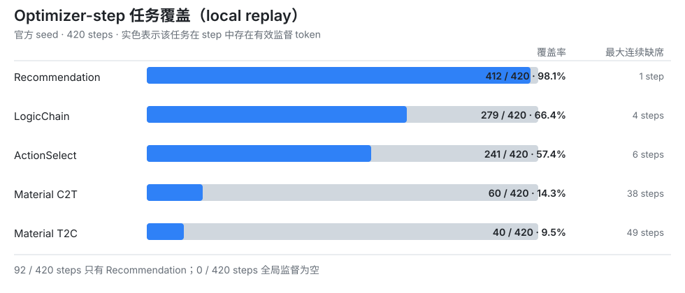

# OneReason / LLM-Rec SFT 复盘

保留从预训练直评到 `0.9881` 的提分路径、六类数据资产，以及尚未验证的机制判断。

## 已验证的提分路径

`懂用户` 为两个用户任务之和，`懂推荐` 为视频、电商、广告、直播四项之和。

> 表中分数均来自已经完成的线上评测。“已验证”表示整套配方曾达到该分数，不代表多因素阶段的每个改动都获得了单变量因果验证。

| 阶段 | 总分 | 懂物料 | 懂用户 | 懂推荐 | 懂世界 | 改动 / 备注 |
| --- | ---: | ---: | ---: | ---: | ---: | --- |
| 预训练直评 | 0.6704 | 0.1533 | 0.0091 | 0.3667 | 0.1413 | 起点；未做 SFT。 |
| LoRA Seed SFT | 0.8635 | 0.1840 | **0.1264** | 0.4174 | 0.1357 | 官方 seed dataset；LoRA 峰值学习率 `2e-4`。 |
| CEval-Letter | 0.9186 | 0.2146 | 0.1031 | 0.4648 | 0.1361 | 加入空 `<think>` + 单字母答案的 CEval 数据。 |
| CEval-Letter + C2T | 0.9263 | 0.2146 | 0.1078 | 0.4618 | 0.1420 | 加入 4,742 条 C2T-SA。 |
| + Math | 0.9573 | **0.2453** | 0.1105 | 0.4529 | 0.1487 | 第一次加入 Math 数据。 |
| + 多因素 | 0.9768 | 0.2146 | 0.1063 | **0.4949** | 0.1610 | LogicChain→Action + Math Plus + Item2 + 视频减半；非单变量对照。 |
| Action100 | **0.9881** | **0.2453** | 0.1157 | 0.4650 | **0.1621** | 在 `0.9768` 直接父模型上追加 Action100。 |

## 六类数据资产

仓库不分发比赛数据或第三方数据行。每个目录只包含数据卡、公开 manifest 和一条合成样例。

| 主线 | 规模 | 样例 | 证据边界 |
| --- | ---: | --- | --- |
| [CEval-Letter](data/ceval-letter/README.md) | 13,948 | [查看 JSONL](data/ceval-letter/example.jsonl) | 有清楚的早期整体正观测，但不是懂世界单项提升。 |
| [懂世界 Math](data/math/README.md) | 21,799 + 21,799 | [查看 JSONL](data/math/example.jsonl) | Math23K 进入过训练；独立 Delta 只完成本地验证。 |
| [Half Video](data/half-video/README.md) | 19,204 → 11,770 | [查看 JSONL](data/half-video/example.jsonl) | 只减半视频行；缺少隔离因果对照。 |
| [LogicChain → ActionSelect](data/logicchain-to-actionselect/README.md) | 1,298 | [查看 JSONL](data/logicchain-to-actionselect/example.jsonl) | 低召回弱标签，不是 FullRecall gold。 |
| [ActionSelect](data/actionselect/README.md) | 104 / 918 | [查看 JSONL](data/actionselect/example.jsonl) | Action100 有一轮正观测；918 条仍待人工语义审核。 |
| [C2T-SA](data/c2t-sa/README.md) | 4,742 | [查看 JSONL](data/c2t-sa/example.jsonl) | seed-unseen `prefix_s_a` + OneReason 域比例重平衡。 |

### 样例速览

以下均为合成样例，只展示任务结构，不对应比赛或第三方真实数据：

- **CEval-Letter**：`[合成题干] + A/B/C/D` → 空 `<think>` + 单字母答案 `B`
- **懂世界 Math**：`3 个盒子 × 每盒 4 个球` → 空 `<think>` + 单字母答案 `C`
- **Half Video**：`[跨域用户历史] + 目标域：短视频` → 一个视频 itemic token
- **LogicChain → ActionSelect**：`[用户历史] + [兴趣主题]` → 一个从历史中复制的 itemic token 列表
- **ActionSelect**：`[用户历史] + [目标兴趣]` → 多个从历史中复制的 itemic token
- **C2T-SA**：`[合成短视频描述]` → 一个匹配描述的视频 itemic token

字段级内容可直接点击上表中的 **查看 JSONL**；数据来源、构造方式和证据边界保留在各自的数据卡中。

## 五个仍待验证的方向

1. **LogicChain prompt 扰动。** 评测日志中的角色、规则、schema、示例和布局比 seed 更丰富；改写 seed prompt 后没有观察到明确正增益，尚不能证明 prompt 多样性可以独立提分。
2. **难样本预算。** item-token loss 权重和 focal `γ` 曾带来超出预期的分数变化。50% Video 方向有效，继续降到 35% 后变弱，说明配比可能是非单调的。
3. **CEval / Math 的跨任务增益。** 两者都意外提高了懂物料。现有 itemic grounding 日志不是选择题，更可能涉及短答案格式稳定、候选判别或未记录完整的配方变量。
4. **optimizer-step 覆盖。** 小任务在很多更新步骤中没有有效监督，可能放大 shuffle 与 packing 引起的训练波动。

   

   本地 replay 中 Recommendation 覆盖 `412/420` steps，ActionSelect `241/420`，LogicChain `279/420`，Material C2T `60/420`，Material T2C `40/420`。该 replay 不是平台真实 batch trace。
5. **ActionSelect 复读。** logs 和本地部署都观察到末项 SID 复读、双 SID 循环和 JSON 数组不闭合。增加数据有所缓解，但尚未解决；数据扩量、数组停止监督、EOS/packing 和 decoding 需要分开验证。

## 目录

```text
.
├── README.md
├── PUBLIC_RELEASE.md
├── assets/
│   └── optimizer-step-coverage.svg
├── data/
│   ├── README.md
│   └── <asset>/
│       ├── README.md
│       ├── manifest.json
│       └── example.jsonl
└── scripts/
    └── check_release.py
```

发布前运行：

```bash
python scripts/check_release.py
```

数据许可和结果表述边界见 [PUBLIC_RELEASE.md](PUBLIC_RELEASE.md)。
